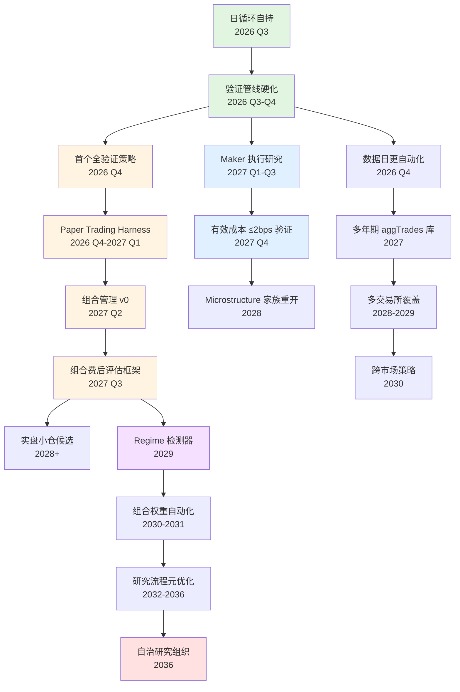
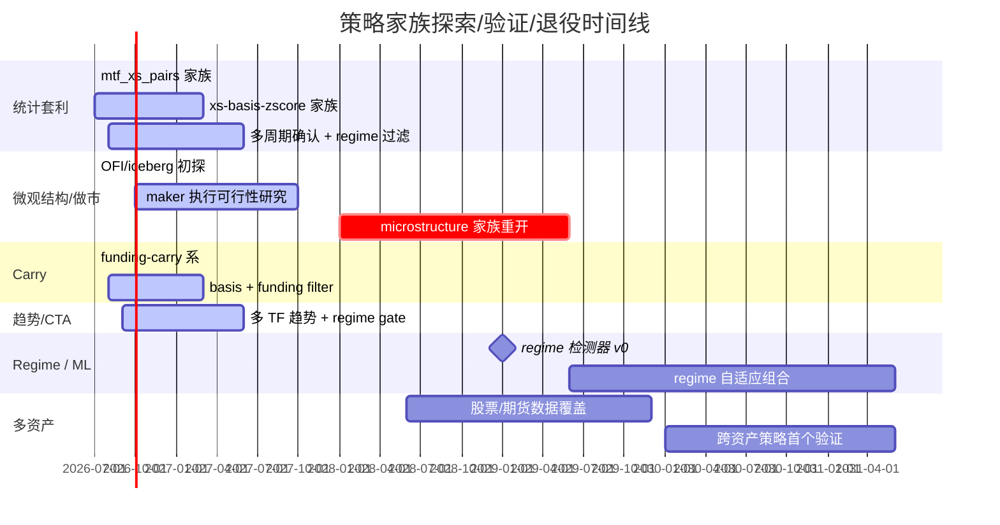

# 十年路线图 2026–2036：从愿景到季度执行

> 上层：`docs/plans/vision-10y-2026-2036.md`
> 关联：`decomposition-2026-h2.md`、`multica-quant-permanent-loop-2026-07-25.md`、
> `agent-org-structure-2026-07-25.md`、`contract-collab/03-contract-collaboration-scheme.md`
>
> 本文是**统一执行层地图**：把愿景拆成年度 → 季度目标，并给出能力依赖、研究时序、
> agent 组织演进、维护机制。每个季度目标都可以直接转化为 issue-map 条目。
>
> 维护：`roadmap-maintainer` autopilot 每月末对照实际产出生成偏差表；
> 连续 2 个月同一项 ❌ 自动 ESCALATE 人类。

---

## 0. 北极星与不变原则

**北极星**：2036 年建成自我进化的自治量化研究组织——机器完成
「假设生成 → 严格验证 → 组合运营 → 退役清算」全链路；人类只设定方向、裁决例外、承担资金决策。

**十年不变的原则**（继承自 `vision-10y-2026-2036.md`）：

1. 验证唯一权威路径：预注册 → walk-forward OOS → 双框架 CV → fee shock → G 门 → 独立签核
2. 并行纪律：基础设施 swarm 化，策略思路单线程
3. 成本纪律：caocao-m3 为唯一默认模型；cost-cap 预检先于代码
4. 证据文化：KILL 有奖、必须有证据指针和复活条件；NOOP 是合法产出
5. 人类例外通道：m3 判不了的走 ESCALATE，永远不升级模型解决判断问题
6. cycle-46：家族耗尽即换轴，禁止参数扫荡式续命

---

## 1. 能力依赖图



**关键依赖说明**：

- `A → B`：日循环能稳定运行，才能持续产出待验证策略，验证管线才有优化素材。
- `B → C`：首个全验证策略是 2026 年度里程碑；没有它，paper harness 没有入住对象。
- `C → D → E`：paper harness 必须先在单个策略上跑通，才能谈组合管理。
- `H → I → J`：maker 执行是 microstructure 家族复活的唯一钥匙；未验证成本 ≤2bps 前禁止重开。
- `E → O → P`：组合管理给 regime 检测器提供多策略数据，才能训练权重自动化。
- `P → Q → R`：只有当组合自动化成熟，研究流程本身的元优化才有意义。

---

## 2. 研究路线图（策略家族时间线）



**研究纪律**：

- 已 KILL 家族（1m/5m 反转、funding-carry 纯系、4h 单 TF stat-arb、T01/T04 microstructure）
  必须满足「复活条件」才能重开：成本/数据/方法论前提被新证据证明成立。
- 2026–2027 主攻方向：
  1. **maker 执行可行性**（决定 microstructure 家族生死）
  2. **多周期统计套利**（已验证范式：多周期确认 + regime 过滤 + 成本感知 sizing）

---

## 3. 年度里程碑（一句话）

| 年份 | 里程碑 |
|---|---|
| 2026 | 基建完成 + 日循环自持 + 首个全管线验证策略出 verdict |
| 2027 | 阶段一验收；paper trading 运行 ≥6 个月；组合管理 v0 上线 |
| 2028 | 组合管理成熟（≥3 低相关策略）+ maker 执行研究出 verdict |
| 2029 | 阶段二验收；若 maker 成功，microstructure 家族重开；regime 检测器上线 |
| 2030 | 多交易所数据 + 第二市场策略族首个全验证策略 |
| 2031 | regime 检测器驱动组合权重自动化 |
| 2032 | 实盘小仓候选（若证据链成立）；研究流程元优化 v1 |
| 2033 | 实盘证据 12 个月复现检查点——决定放大或冻结 |
| 2034 | 元优化 v2：系统自主提出并验证研究方法论改进 |
| 2035 | 全生命周期自动化审计链 |
| 2036 | 阶段三验收：≥10 个完整策略生命周期无人干预完成 |

---

## 4. 季度目标拆解

### 阶段一：地基与自持循环（2026–2027）

#### 2026 Q3：让循环转起来

| 季度目标 | 验收标准 | 负责层 | 关键产物/ issue | 阻塞风险 |
|---|---|---|---|---|
| Q3-1 基建收口 | infra sprint 68 任务 6 波次执行完毕；INT-05 9 条不变量全 PASS | L3 multica-code / ops-worker-1 | `SMA-36455` 及子 issue | PR#14/15 CI 失败；.105 部署窗口 |
| Q3-2 signal-enhance-h3 全历史 verdict | 7 窗 walk-forward + 60bps fee shock 出 KEEP/KILL | L2 quant-researcher + L3 multica-strategy | `SMA-36661` 后续 issue | 可视化规范未补齐；费用口径 |
| Q3-3 日循环天天跑 | 09:00 scout / 21:00 retro 连续 30 天有 traceable 产出 | L1 multica-orchestrator + L5 knowledge-curator | 每日 digest 文件 | autopilot 触发失败无人修 |
| Q3-4 server gate 严格化落地 | 缺字段=FAIL；sharpe-only 上传判 fail；部署到 .105 | L3 multica-code | `server/internal/gate/gate.go` migration | 部署窗口冲突 |

#### 2026 Q4：从循环到产出

| 季度目标 | 验收标准 | 负责层 | 关键产物 | 阻塞风险 |
|---|---|---|---|---|
| Q4-1 首个全验证策略 | ≥1 策略通过全 G 门 + 双框架 CV + 60bps fee shock | L2/L3/L4 研究流线 | results-ledger.md LIVE 条目 | Q3 无合格候选 |
| Q4-2 Paper Trading Harness 重建 | `_shared/paper/` 上线；首个策略入住；无重复记账 bug | L3 multica-code | 新 harness + 回归测试 | 数据时序/撮合复杂度 |
| Q4-3 数据日更自动化 | klines/funding 每日增量；staleness >48h 告警 | L3 ops-worker-1 | cron + 状态页 | 数据源 API 变更 |
| Q4-4 Compare 页面唯一事实源 | 三态徽章 + KILL 灰显 + verdict 区块；ledger 自动生成 | L3 multica-code | compare 页更新 | 前端 CI 持续失败 |

#### 2027 Q1：Paper 运行 + 组合雏形

| 季度目标 | 验收标准 | 负责层 | 关键产物 |
|---|---|---|---|
| Q1-1 Paper trading 连续运行 3 个月 | 每周 paper 净值更新；无重大 harness bug | L3 multica-strategy + ops | paper-ledger.md |
| Q1-2 组合管理 v0 设计 | 相关性矩阵 + 等权组合净值计算 SPEC | L2 quant-researcher | SPEC.md |
| Q1-3 Maker 执行预研究 | 文献扫描 + 队列位置模型数据可行性结论 | L2 quant-research-agent | 调研报告 |
| Q1-4 日循环吞吐达标 | ≥5 SPEC 预检/周、≥2 全管线验证/周 | L1 orchestrator | 吞吐仪表盘 |

#### 2027 Q2：组合上线

| 季度目标 | 验收标准 |
|---|---|
| Q2-1 组合管理 v0 上线 | H1 + 1–2 个新验证策略的等权组合净值进入 run_metric |
| Q2-2 组合级回撤预算 | 组合最大回撤预算、单策略权重上限机制 SPEC + 实现 |
| Q2-3 Maker 执行正式立项 | 形成 T10 thread；数据回放框架搭建 |
| Q2-4 阶段一中期审计 | 连续 90 天日循环无人干预 + 重复犯错率 = 0 |

#### 2027 Q3：执行研究推进

| 季度目标 | 验收标准 |
|---|---|
| Q3-1 Maker 执行模型 v0 | 队列位置/库存模型实现；历史撮合回放跑通 |
| Q3-2 组合费后评估框架 | 组合级 Sharpe/回撤/容量进入 run_metric |
| Q3-3 多年期 aggTrades 库 | ≥1 年 aggTrades 数据可用； freshness 告警 |
| Q3-4 新策略候选池 | ≥3 个不同家族策略进入全管线验证 |

#### 2027 Q4：阶段一验收 + 执行 verdict 准备

| 季度目标 | 验收标准 |
|---|---|
| Q4-1 阶段一验收 | 连续 30 天无人干预日循环 + 1 个 paper 中的全验证策略 + 重复犯错率 = 0 |
| Q4-2 Maker 执行 verdict | 历史回放证明 maker 有效成本 ≤2bps 是否可达；出 KEEP/KILL |
| Q4-4 2028 年度计划 | 生成 `decomposition-2027.md` / `decomposition-2028.md` |

### 阶段二：组合与执行升级（2027–2029）

#### 2028

| 季度 | 目标 | 验收标准 |
|---|---|---|
| Q1 | 组合权重初优化 | 等权 → 波动率倒数加权；组合 Sharpe 提升 ≥10%（paper） |
| Q2 | 组合相关性监控 | 实时相关性矩阵；>0.5 告警并触发策略权重调整 |
| Q3 | Maker 执行若 KEEP → 小流量实盘沙盒 | 真实撮合回放 + 小单测试；cost 实测 ≤2bps |
| Q4 | Microstructure 家族首个新 SPEC | 基于 maker 执行的新策略进入全管线验证 |

#### 2029

| 季度 | 目标 | 验收标准 |
|---|---|---|
| Q1 | Regime 检测器 v0 | 市场状态分类器（牛/熊/震荡）准确率 >60%；集成到组合权重 |
| Q2 | 阶段二中期审计 | 组合层面费后 Sharpe >1.0、最大回撤 <20% 持续 6 个月（paper） |
| Q3 | 多交易所数据 v0 | ≥2 个交易所 klines/funding 标准化入库 |
| Q4 | 阶段二验收 | 组合层面费后 Sharpe >1.5、最大回撤 <15% 持续 12 个月；maker 成功则 microstructure 家族 ≥3 个 SPEC |

### 阶段三：自治与规模（2029–2036）

#### 2030

| 季度 | 目标 |
|---|---|
| Q1–Q2 | 第二市场策略族首个全验证策略（股票/期货） |
| Q3–Q4 | Regime 自适应组合权重上线：系统自动识别市场状态并调权 |

#### 2031

| 季度 | 目标 |
|---|---|
| Q1–Q2 | 组合权重完全自动化；人类只设定风险偏好 |
| Q3–Q4 | 策略退役自动化：KILL 策略自动灰显、资金自动再平衡 |

#### 2032

| 季度 | 目标 |
|---|---|
| Q1–Q2 | 实盘小仓候选（若 2029 组合证据成立） |
| Q3–Q4 | 研究流程元优化 v1：自动调整 SPEC 预检阈值、窗口数 |

#### 2033

| 季度 | 目标 |
|---|---|
| 全年 | 实盘证据 12 个月复现检查点；决定放大或冻结 |

#### 2034

| 季度 | 目标 |
|---|---|
| Q1–Q2 | 元优化 v2：系统自主提出研究方法论改进假设并验证 |
| Q3–Q4 | 多资产类别扩展（期权按数据可得性） |

#### 2035

| 季度 | 目标 |
|---|---|
| 全年 | 全生命周期自动化审计链；每次判决可回放证据 |

#### 2036

| 季度 | 目标 |
|---|---|
| 全年 | 阶段三验收：≥10 个完整策略生命周期无人干预完成 |

---

## 5. Agent 组织演进

### 阶段一（2026–2027）：维持现有 14 agent

沿用 `agent-org-structure-2026-07-25.md` 的 L0–L5 结构：

- L1：multica-orchestrator、multica-ops
- L2：quant-researcher、quant-research-agent、quant-analyst
- L3：multica-strategy、strategy-worker-1/2、multica-code、ops-worker-1
- L4：smark-decision-maker、smark-signoff-proxy
- L5：knowledge-curator、persona-advisor

### 阶段二（2027–2029）：新增 2 个角色

| 新角色 | 层 | 职责 | 与现有角色关系 |
|---|---|---|---|
| `portfolio-manager` | L3 | 组合权重、相关性监控、组合级回撤预算 | 接收 multica-strategy 验证通过的策略；输出组合配置给 paper harness |
| `execution-researcher` | L2 | maker 执行、队列模型、撮合回放研究 | 与 quant-researcher 平级；产出 execution SPEC |

### 阶段三（2029–2036）：新增 2 个角色

| 新角色 | 层 | 职责 |
|---|---|---|
| `regime-detector` | L2 | 市场状态分类器、regime 自适应信号 |
| `meta-evolver` | L1 | 研究流程元优化：调整预检阈值、窗口数、派单策略；提出方法论改进假设 |

**演进纪律**：新角色在需要时才创建，不提前造岗位。每个新角色必须有明确的接单范围、拒绝路径、验收证据模板。

---

## 6. 季度目标验收契约模板

每个季度目标在转化为 issue 时，issue body 顶部必须包含如下契约块：

```yaml
contract_version: 1
task_id: SMA-XXXXX
title: "2026 Q3-1 基建收口"
layer: L3
issuer: multica-orchestrator
assignee: multica-code
valid_until: 2026-09-30T23:59+08
timeout: 4h

preconditions:
  - type: artifact_exists
    ref: docs/plans/infra-sprint-2026-07-25/issue-map.json@<SHA>
  - type: upstream_merged
    ref: main@<SHA>

deliverables:
  - type: git_branch
    pattern: agent/multica-code/SMA-XXXXX
  - type: file
    path: docs/plans/infra-sprint-2026-07-25/VERDICT.md

acceptance_evidence:
  - check: git_remote_branch_exists
    ref: origin/agent/multica-code/SMA-XXXXX
  - check: command_exit_zero
    run: pytest quant-loop/tests/ -x
  - check: json_fields_present
    ref: docs/plans/infra-sprint-2026-07-25/VERDICT.md
    fields: [wave_status, invariant_results, signoff_chain]

breach_policy:
  on_precondition_fail: escalate_to_issuer
  on_postcondition_fail:
    action: redispatch_new_assignee
    escalation_ladder:
      - redispatch_new_assignee
      - orchestrator_review
      - escalate_human
  on_timeout: cancel_with_NOOP_comment

signoff_chain:
  required: [smark-signoff-proxy]
  prohibited_self_sign: true
  requires_attestation_run: true

invariants:
  - comment_schema_compliant
  - no_layer_crossing
```

---

## 7. 维护机制：`roadmap-maintainer` autopilot

### 触发

- cron：`0 22 28-31 * *`（每月最后一天 22:00 +08）
- 额外触发：每次 epoch-retro 完成后

### 职责

1. 读取本文当前季度目标
2. 统计上月实际产出：
   - SPEC 预检数（quant-research-agent / quant-researcher 产出）
   - 全管线验证数（multica-strategy 产出）
   - KEEP/KILL/NOOP 数（smark-decision-maker 产出）
   - epoch-retro digest 链接
3. 生成本季度目标 vs 实际偏差表
4. 连续 2 个月同一项 ❌ → 创建 `[need-smark-decision: roadmap-deviation]` issue
5. 每季度末提出下季度目标细化建议（以 draft PR / 评论形式）

### 输出格式

评论首行必须：

```
[type=STATUS] 2026-07-31T22:00+08 roadmap-maintainer 月度偏差扫描
```

正文：

```markdown
## 本月实际产出
- SPEC 预检：N
- 全管线验证：M
- KEEP/KILL/NOOP：...

## 当前季度目标偏差
| 目标 | 进度 | 偏差 | 行动 |
|---|---|---|---|
| Q3-1 基建收口 | 80% | INT-05 待跑 | 指派 multica-code |
| ... | ... | ... | ... |

## 需要 smark 决策
- [ ] 若某目标连续 2 个月 ❌
```

---

## 8. 链接与指针

- 愿景层：`docs/plans/vision-10y-2026-2036.md`
- 2026 H2 月级拆解：`docs/plans/decomposition-2026-h2.md`
- 日循环设计：`docs/plans/multica-quant-permanent-loop-2026-07-25.md`
- 组织结构：`docs/plans/agent-org-structure-2026-07-25.md`
- 契约协作：`docs/plans/contract-collab/03-contract-collaboration-scheme.md`
- 可视化规范：`docs/plans/quant-visualization-mandate.md`
- 当前 sprint：`docs/plans/infra-sprint-2026-07-25/`
