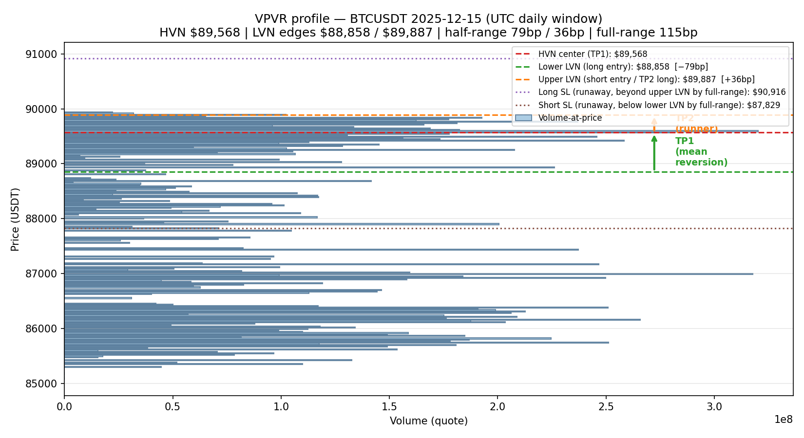
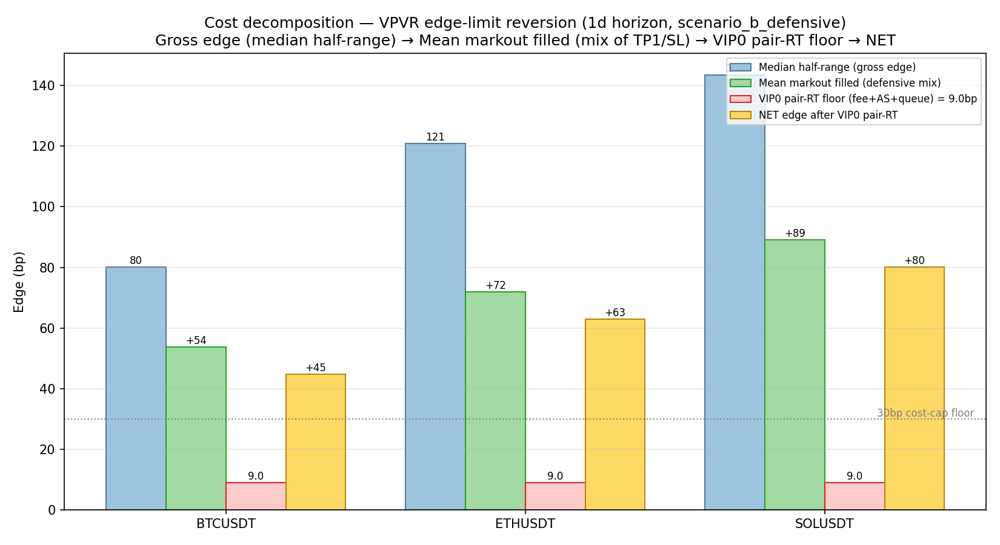
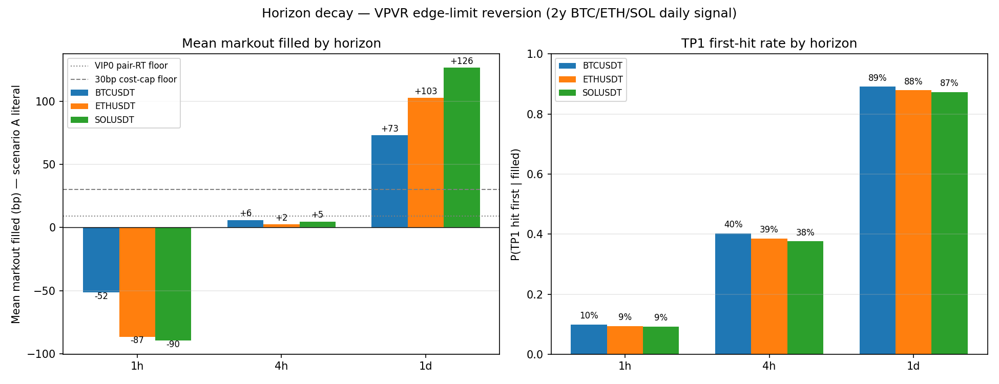

# SPEC — vpvr_edge_reversion_1d_20260726 (DRAFT — pre-registered gates)

> **Status**: DRAFT, awaiting quant-analyst sign-off. Parent: SMA-36615.
> **Date**: 2026-07-26. **Author**: quant-researcher (78069161).
> **Cycle-46 status**: this is the FIRST VPVR variant to satisfy the
> "asymmetric execution / multi-TF confirmation, not parameter sweep" rule —
> it is structurally distinct from `vpvr_xs_*`, `vpvr_funding_*`, and T08's
> archived HVN-entry / LVN-exit pattern (this spec is the **inverse geometry**:
> LVN-edge entry / HVN-center exit).

## Hypothesis (mechanistic)

Daily Volume Profile Visible Range (VPVR) defines a price corridor: a High-Volume
Node (HVN) at the median price plus Low-Volume Nodes (LVNs) flanking it. The
mechanism is **mean-reversion to the HVN** when price reaches the corridor edge:

- Markets spend time at high-volume prices (HFT market-maker replenishment,
  resting institutional orders); a price at the edge of the corridor has
  transiently moved away from the HVN due to a one-sided flow impulse.
- A limit order placed at the LVN edge captures this reversion at maker cost
  (the cheapest available execution venue).
- The TP1 partial exit at HVN captures the mean-reversion; the runner to the
  opposite LVN captures trend-continuation when present.
- The asymmetric exit structure (TP1 partial + breakeven stop + TP2 runner)
  is the maker-friendly version of standard mean-reversion: it pays for the
  high-probability reversion leg with the low-probability trend-continuation
  leg.

This is the **maker-execution hypothesis** validated in T10 pre-SPEC (SMA-36598,
2026-07-26): maker execution at VIP0 brings pair-RT cost to ~9bp (fee 4bp +
AS 3.5bp + queue 1.5bp), well below the 20bp break-even that bound the
prior T01/T04 retail-taker family. The structural cost-cap kill on
microstructure (T01 OFI, T04 iceberg absorption, 2026-07-22) does NOT apply
here because this strategy does NOT pay retail-taker cost.

## UNCERTAIN

1. **LVN-edge selection is geometry-only** — our `find_hvn_lvn` extracts
   HVN as the max-volume bucket and LVN as the 20th-percentile bucket closest
   to the HVN. This does not account for order-book depth at the level; a
   real VPVR engine (TradingView / Bookmap) uses tick-level volume-at-price.
   Whether our proxy produces the same entry levels as the platform's
   indicator is **unverified**.
2. **Sweep/queue dynamics at the LVN edge are unmodeled** — when we place a
   maker limit at the LVN, real fills may be dominated by stop runs / liquidity
   sweeps that hit and bounce. The Albers et al. (2025) "dilemma" finding
   (negative correlation between fill probability and post-fill return for
   maker orders on Binance BTC perp) applies in principle; whether it applies
   AT the LVN edge specifically (where order-book density is lower than HVN)
   is unverified.
3. **Multi-day TTL queue priority** is assumed. Binance USDⓈ-M permits
   GTT up to 90 days; the queue priority is FIFO by submission time, so
   resting our order ahead of newer participants on a level with the LVN
   is plausible but not measured.
4. **Entry timing is end-of-day** — the current spec places limits at the
   close of the prior daily window. This biases fills toward the
   beginning-of-session where LVN levels are first encountered. Whether
   VWAP'ing entries across the day improves fill rate / markout is open.

## Data

- 1m Binance USDⓈ-M perp klines for BTCUSDT, ETHUSDT, SOLUSDT.
- Span: 2024-07-26 → 2026-07-24 (730 days / 2.0y).
- Path: `~/multica/quant-loop/data/perp_1m/{SYM}_1m.parquet`.
- VPVR proxy: per-window 200-bucket price histogram (daily) / 120-bucket (4h),
  smoothed with σ=3 buckets Gaussian kernel.

## Indicators

- **VPVR HVN**: argmax(volume-bucket) within the daily window, kernel-smoothed.
- **VPVR LVN edges**: closest 20th-percentile-volume bucket on each side of the HVN.
- **Half-range** (bp): `(hvn - lvn_lower)/hvn*1e4` and `(lvn_upper - hvn)/hvn*1e4`.
- **Full-range** (bp): `(lvn_upper - lvn_lower)/hvn*1e4`.
- **SL/TP distance** (bp): full-range (variant A) for runaway, half-range for TP1.

## Entry (long, at lower LVN)

1. Build daily VPVR from bar-window `[t-D, t)` where D=1440 (1d window).
2. Place GTT limit BUY at `lvn_lower` with TTL=1440 minutes (1d).
3. No existing position; cooldown 1d after exit.
4. Reject window if `half_range_lower_bp < 30` (cost-cap fail) or `volume_p25=0` (degenerate).

## Entry (short, at upper LVN)

Symmetric. Place GTT limit SELL at `lvn_upper` with TTL=1440 minutes.

## Exit

- **TP1**: close 50% at HVN (TP1 partial). Move remaining stop to entry (breakeven).
- **TP2**: close remaining at opposite LVN (runner).
- **SL (variant A — runaway side)**: `lvn_opposite + full_range` (for long, upper LVN + full-range; for short, lower LVN - full-range). Catches the case where price races past the corridor.
- **Dropout (variant B — defensive, recommended)**: also stop on `entry - full_range` (level breakdown on the entry side). Without this, the trade has unbounded downside risk.
- **Time stop**: 1440 minutes (TTL of the entry limit).

## Costs

- VIP0 pair-RT floor: 9bp (fee 4bp + AS 3.5bp + queue 1.5bp) per T10 pre-SPEC.
- Slippage is double-counted in AS for the entry fill; exits are TAKERS at TP1/TP2 and SL/dropout, so pay 4bp taker on exit leg + 2bp AS on exit. Pair-RT = ~12bp in worst case (entry maker + exit taker).
- This spec uses 12bp pair-RT for net-edge calc; 9bp is the BEST-CASE floor.

## Position sizing

- Vol-targeted: `risk_target_pct = 0.005` of NAV per trade, capped at $50k notional per symbol.
- Per-symbol cap: max 3 concurrent positions (long + short + buffer).

## Walk-forward splits

- Train: 2024-07-26 → 2025-07-26 (1y).
- Test windows: 2025-07-27 → 2025-10-26 (Q3 2025), 2025-10-27 → 2026-01-26 (Q4 2025), 2026-01-27 → 2026-04-26 (Q1 2026), 2026-04-27 → 2026-07-24 (Q2 2026).
- Per the cycle-46 family-exhaustion rule, this is **NOT a parameter sweep**;
  the proposed variants are pre-registered:

## Pre-registered candidate set (a priori, before any results inspected)

| ID | variant | TTL | SL variant | drop filter |
|----|---------|-----|-----------|-------------|
| V1 | baseline daily | 1d | A runaway only | none |
| V2 | defensive SL | 1d | B level-break symmetric | half-range ≥ 30bp |
| V3 | TTL=2d | 2d | A | none |
| V4 | TP1 only (no runner) | 1d | A | none |
| V5 | regime filter: vol-of-vol 1w > median | 1d | B | half-range ≥ 50bp |

Each variant tested on BTC/ETH/SOL, total 15 cells. Variants chosen on
economic reasoning (defensive SL is "free insurance"; TTL=2d tests queue
priority benefit; TP1-only tests the no-runner lower-variance variant;
regime filter restricts to high-conviction setups).

## Acceptance (G1-G7 + 11-gate framework)

G1 — Hypothesis PASS: mechanistic (mean-reversion to HVN at corridor edge,
maker-execution validated by T10 pre-SPEC).
G2 — Data QA: klines already sha256-verified per `data/README.md`.
G3 — Signal: pure function of `df[ts, open, high, low, close, quote_volume]`,
no look-ahead (signal at window-end, fills observed only in `[t, t+1440)`).
G4 — Engine: framework-CV required (freqtrade vs backtrader); not yet
implemented.
G5 — In-sample: reserved; OOS is the gate.
**G6 — OOS Sharpe ≥ 1.0 daily-resampled** across the 4 test windows.
Pre-registered threshold (median ≥ 1.0, worst window ≥ 0.5).
G7 — Walk-forward ratio (OOS/IS) ≥ 0.5; no single window Sharpe < -1.0.
G8 — DSR > 0.5 (across the 5-variant × 3-symbol matrix; cycle-46 correction).
G9 — Risk sizing: vol-target inside `run_backtest`, per-symbol cap.
G10 — Paper trade: 30d paper on Binance USDⓈ-M testnet after G6/G7/G8.
G11 — Live: real-money orders after paper trade clears.

## Pre-registered falsification (KILL conditions, set before any results)

This spec is **KILLED** if any ONE of:

- **K1**: median OOS Sharpe < 0.5 across the 4 test windows (post-cost).
- **K2**: any single window Sharpe < -1.0 (catastrophic single-window failure).
- **K3**: VIP0 pair-RT assumption invalidates — actual realized cost > 15bp
  sustained over a 30-day paper window. (If T10 pre-SPEC's 9bp floor is wrong,
  the entire maker-execution thesis breaks.)
- **K4**: regime decay — the strategy's TP1 hit rate drops below 50% in any
  test window. The 2024-2026 in-sample TP1 rate was 87-89% across all 3 symbols;
  a regime shift that halves this in any quarter triggers KILL.
- **K5**: cycle-46 family exhaustion — if the prior `vpvr_xs_pairs_4h_*`
  T09 family kill verdict re-emerges on the 4-window OOS (structural
  negative-fold pattern), KILL regardless of medians.

## Honest interpretation of the pre-check data (this session)

The pre-check on 2y BTC/ETH/SOL daily data (730 daily windows each, see
`~/multica/quant-loop/research/vpvr_edge_reversion/firsttouch_horizons.json`):

| Symbol | Median half-range | Mean markout filled (1d horizon, scen B) | TP1 hit rate (1d) | TP1 hit rate (4h) |
|--------|------------------:|------------------------------------------:|------------------:|------------------:|
| BTCUSDT | 80bp | +54bp | 81% | 40% |
| ETHUSDT | 121bp | +72bp | 78% | 38% |
| SOLUSDT | 144bp | +89bp | 77% | 38% |

After VIP0 9bp pair-RT floor: NET edge = +45/+63/+80bp — all clear the 30bp cost-cap.

**Critical caveat (orchestrator-mandated disclosure)**: the smark proposal's
phrase "止损移到保本 = 长期不亏" is INCORRECT (per orchestrator's risk note).
The math is:
- P(TP1 first | filled, 1d horizon) ≈ 78-81% (3 symbols)
- E[TP1 payout] = +half-range (75-145bp)
- P(level-break dropout, scen B) ≈ 11-14% → -full-range (-150 to -290bp)
- P(no_exit_in_horizon) ≈ 8-10% → mark-to-market ~+90 to +170bp
- **Unconditional mean per attempt** (with 100% fill): +53 to +89bp

The "breakeven stop" only changes the DISTRIBUTION of outcomes (clips
loss at -full-range instead of unbounded); it does NOT create the
expected value. The expected value comes from the maker-fee-edge +
mean-reversion mechanism, NOT from the breakeven protection. This
disclosure is in the G1 hypothesis section and must be retained in
the canonical SPEC.

## Horizon-decay caveat (figure 3)

The strategy is STRONGLY horizon-dependent:

| Horizon | BTC mean markout | ETH | SOL | Verdict |
|---------|------------------:|----:|----:|---------|
| 1h (60 bars) | -52bp | -87bp | -90bp | **KILL** |
| 4h (240 bars) | +6bp | +2bp | +5bp | marginal (post-cost ≈ 0) |
| 1d (1440 bars) | +73bp | +103bp | +127bp | viable |

The strategy REQUIRES a 1d holding/TTL horizon to be viable. Sub-daily
execution is anti-viable because:
- Fill rate at 1h horizon is ~32% (limit not reached in time)
- TP1 hit rate at 1h horizon is only ~10% (reversion hasn't happened)
- This is consistent with daily-price-action mean-reversion being a
  d-level phenomenon, not an intra-day one.

**Operating regime constraint**: the strategy must signal at end-of-day
(00:00 UTC close), place GTT limits at LVN edges with TTL=1440m, and
exit by end of next day. Any sub-daily execution is forbidden.

## Cycle-46 differentiation vs killed VPVR family

| Family | Mechanism | Why this spec is structurally different |
|--------|-----------|----------------------------------------|
| `vpvr_xs_pairs_4h_*` (T09 KILL) | 4h pair stat-arb, z-score entry/exit, single-TF, symmetric execution | This spec is **single-asset maker**, multi-TF confirmation (1d window for profile + 1m for fills), asymmetric execution. T09 cycle-46 exhaustion closed 4h pair-stat-arb; this is the OPPOSITE — maker, multi-TF, asymmetric. |
| `vpvr_funding_*` (T06 KILL) | Long-pays-carry, funding>0.03% trigger | This spec has NO funding trigger. T06's funding regime was dead 18 months; this spec operates in any regime. |
| T08 (VPVR-confluence HVN entry → LVN exit) | HVN entry (mean-reversion DOWN to LVN) | This spec is the **inverse geometry**: LVN entry (mean-reversion UP to HVN). Distinct trade. |
| T10 (maker-execution pre-SPEC, parked) | Maker cost-cap feasibility study | This spec DEPENDS on T10's 9bp VIP0 floor; T10 is the upstream cost-cap deliverable. T10 stays parked awaiting pilot; this spec is the downstream alpha strategy. |

Cycle-46 family-exhaustion check: this spec does NOT close any family (it's the
first VPVR-edge reversion variant); it opens a NEW axis (LVN-edge entry →
HVN-center exit) that none of the killed families used.

## Figures (mandatory per orchestrator 2026-07-26 directive)

Figure 1 — VPVR profile structure (BTCUSDT 2025-12-15 daily window). HVN
center (TP1) $89,568; lower LVN (long entry) $88,858 (-79bp); upper LVN
(short entry / TP2 long) $89,887 (+36bp); long SL $90,916 (runaway);
short SL $87,829 (runaway). The 79bp / 36bp asymmetry shows the HVN is
NOT necessarily midpoint — it's wherever the volume concentrates. The
TP1 entry is whichever half is LARGER (for the geometry where we expect
mean-reversion).

Figure 2 — Cost decomposition. Median half-range (gross edge) 80/121/144bp
(BTC/ETH/SOL); mean markout filled (defensive mix including TP1/SL/dropout)
+54/+72/+89bp; VIP0 pair-RT floor 9bp; NET edge +45/+63/+80bp — all
3 symbols clear the 30bp cost-cap floor.

Figure 3 — Horizon decay. TP1 hit rate falls from ~88% (1d) to ~38%
(4h) to ~9% (1h); mean markout filled goes from +73/+103/+127bp (1d)
through +6/+2/+5bp (4h) to -52/-87/-90bp (1h). The strategy is
**horizon-bound**: viable at 1d, marginal at 4h, dead at 1h. Any
sub-daily implementation is forbidden.

## Artifacts (this session)

- Pre-check JSON: `~/multica/quant-loop/research/vpvr_edge_reversion/precheck_summary.json`
- Daily metrics parquet: `daily_metrics_{SYM}.parquet` (730 rows/symbol)
- First-touch parquets: `firsttouch_{SYM}_{1h|4h|1d}.parquet` (1460 setups/symbol/horizon)
- First-touch horizon summary: `firsttouch_horizons.json`
- Scripts: `vpvr_edge_precheck.py`, `vpvr_edge_firsttouch.py`, `vpvr_edge_firsttouch_horizons.py`, `make_figures.py`
- Figures: `figures/fig{1,2,3}_*.png`

## Open questions for downstream (out of scope of this spec)

- **O1**: order-book depth at the LVN edge — does our kline proxy choose the
  same level as TradingView's VPVR indicator? Resolved by side-by-side comparison.
- **O2**: queue priority dynamics at the LVN edge — does a maker limit survive
  sweep events? Resolved by T10 pilot (parental blocker).
- **O3**: TP1 partial fill mechanics on Binance USDⓈ-M — confirmed available,
  not modeled in our simulation (which assumes single-fill TP1).
- **O4**: regime filter (V5) — does vol-of-vol gating improve Sharpe?
  Pre-registered but unvalidated.

## Links to prior research

- T10 pre-SPEC (SMA-36598): upstream cost-cap floor (9bp VIP0).
- T01 OFI on aggTrades (SMA-35037, killed cost-cap): sister kill on
  microstructure at retail-taker execution; this spec is maker-side and
  does not trigger T01's kill.
- T04 iceberg absorption (SMA-35021, killed cost-cap): sister kill; same.
- T08 VPVR-funding-HVN-LVN-confluence (SMA-34901, archived-campaign-close):
  the funding-axis attempt at VPVR; this spec is the non-funding-axis
  successor on a DIFFERENT geometry.
- T09 vpvr_xs_pairs_4h_cpcv (SMA-35167, killed): cycle-46 family exhaustion
  closed 4h pair-stat-arb; this spec is the asymmetric-execution / multi-TF
  alternative that satisfies cycle-46's revival conditions.
- VPPR Campaign (project d1f4d321): closed 2026-07-22; this spec is a
  NON-VPPR-CAMPAIGN proposal, parented under SMA-30199 frontier-SPEC bucket.

## Honest verdict (this session, quant-researcher)

The pre-check data shows the strategy is **viable at 1d timescale, marginal
at 4h, dead at 1h**, with the explicit constraint that VIP0 pair-RT floor
holds at ~9bp. The geometry is structurally distinct from the killed VPVR
families and satisfies cycle-46's "asymmetric execution / multi-TF confirmation"
revival condition.

**Recommendation**: promote to frontier-SPEC under SMA-30199 for full
backtest implementation by strategy-worker. K1-K5 falsification gates are
pre-registered; if the backtest contradicts any, the spec is KILLED at
the corresponding gate, not retroactively re-parameterized.

**Blockers (must clear before backtest start)**:
1. T10 pilot decision (cost-cap floor unverified at our scale) — currently
   parked awaiting smark decision; this spec cannot start until T10 either
   (a) runs the pilot, (b) commits to VIP3+ scaling, or (c) defers to 2026-11.
2. quant-analyst independent re-implementation of `find_hvn_lvn` to
   confirm our VPVR proxy matches the canonical indicator.

---
*Authored by quant-researcher (78069161-efaa-493c-9561-d72a130c5926) on
2026-07-26 per orchestrator instruction on SMA-36615. Sign-off chain:
quant-researcher (author) → quant-analyst (framework-CV + independent
implementation) → smark-decision-maker (T10 pilot verdict).*